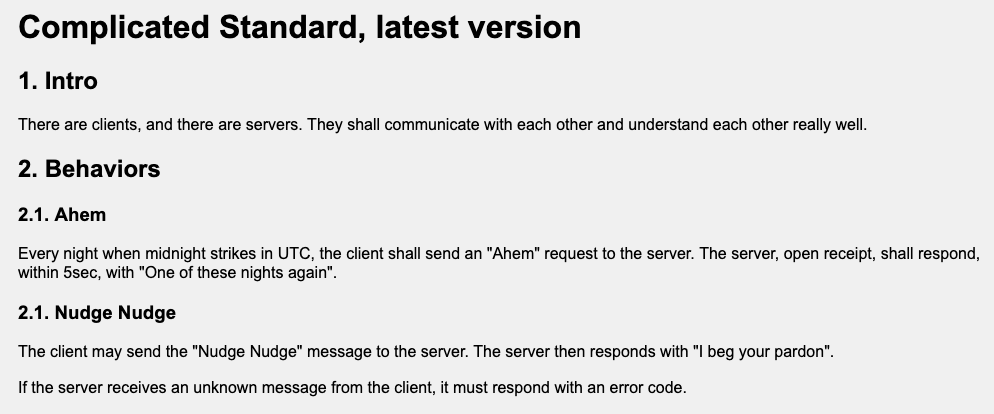
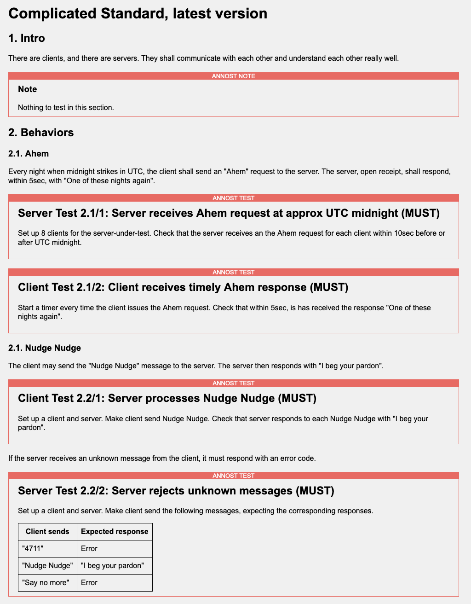

## ANNOST: ANNOtate your Spec with Tests (ANNO-S-T).

### The problem: relating specifications to their tests

Imagine you have to write some tests for a protocol specification. Say, you want to test ActivityPub
or WebFinger or HTTP. These are standard protocols, so they are defined in standards documents
created by the W3C or the IETF or such.

Unless the standards organization has developed a conformance test suite, you somehow need to
translate the standards document into a set of tests that you can run against your code. How would
you go about that? (This also applies if you are/represent the standards organization yourself
and you try to define tests for your own standard.)

There are likely going to be dozens, maybe 100's of tests -- depending on the complexity of the
protocol -- that you need to define to get reasonable test coverage. Managing those is not
simple, for several reasons:

* If you look at a given test you wrote (or worse, that somebody else wrote): how do you determine
  which part of the specification it claims to test? How do you easily review whether the test
  actually does a good job at testing what the spec says?

* If you read the specification, how do you know whether a test has been defined for a given
  paragraph, or perhaps many have been defined (which?), and whether they together constitute good
  test coverage for that paragraph? How do you go from a place in the spec to a specific file
  or function in your test suite?

* Many standards documents repeat themselves a bit. E.g. they may state the same requirements once
  in the introduction, and then later in another section. How do you make sure you don't create basically
  the same test multiple times, or not at all because you thought you covered it "over there"?
  That is a real problem for long standards.

* Standards evolve. If you compare the newer version with the old version of the specification,
  how do you make corresponding changes to the tests in your test suite? Which tests remain unchanged,
  which need to be changed or dropped, which new text requires new tests?

### The solution: if you are very diligent and have a lot of time ...

... you are going to come up with some kind of spreadsheet, or such, and review the connections
between specs and tests so often that you can definitely manage.

But then, if you are like that, you are not like me.

### The solution: if you are like me, and want to "see" that connection between specs and tests more directly ...

... then you use ANNOST: hack the spec document by inserting your tests right into the spec.

Sounds atrocious? Yep, it is. But also surprisingly useful and usable.

### Example

There is a toy example in this directory. Here are screenshots, to try it your self you
need to clone this repo and open the HTML files locally in your browser.

Here's a screen shot of the [unmodified spec](complicated-standard.html):

Here's a screen shot of the [spec with ANNOST annotations](complicated-standard-annost.html):

Other than adding a Javascript include into the HTML header, the boxes were created by
adding markup such as the following:

<pre>
  &lt;annost-test testid='2.1/1' name='Server receives Ahem request at approx UTC midnight' role='Server' level='MUST'&gt;
   &lt;p>Set up 8 clients for the server-under-test. Check that the server receives an the Ahem
   request for each client within 10sec before or after UTC midnight.&lt;/p&gt;
  &lt;/annost-test&gt;
</pre>

### How does it work?

You need to work with a spec whose format is HTML, because we are using HTML trickery (custom
HTML tags / [Web Components](https://en.wikipedia.org/wiki/Web_Components).)

1. Make a copy of the spec, such as `complicated-standard.html` to `complicated-standard-annost.html`.

1. Open the annosted HTML file in a browser window.

1. Edit `complicated-standard-annost.html` and this single line to the HTML HEAD:

   <pre>&lt;script src="annost.js"&gt;&lt;/script&gt;</pre>

1. Open the annosted HTML file in an editor. As you keep reading through the spec in your browser,
   every time you think, "hmm, this might be a test", you find the corresponding place in the
   HTML in your editor, and you add an ANNOST web component. Currently you have three to choose
   from:

   * <pre>&lt;annost-test testid="SECTION/INDEX" name="NAME" role="ROLE" level="LEVEL">
     LONG DESCRIPTION...
     &lt;/annost-test&gt;
     </pre>

     This defines a test. You give it a `testid` derived from the SECTION of the spec in which
     you define this test, and another local identifier (INDEX) to disambiguate in case you have
     several tests in the same section. NAME is a short name so you can remember what it is. ROLE
     indicates whether this tests the client, or the server, or whatever other roles you have in your
     protocol, and LEVEL is something like "must" or "should". LONG DESCRIPTION: you provide
     as much detail as needed so the test can be coded.

     When you code the test, you name it based on SECTION/INDEX and/or NAME, so it is easy
     to go from test to spec (we know the section in which it was defined) and from spec
     to test (it's named after the section, and the content of the above tags is inlined
     right in your browser in the context of the spec).

   * <pre>&lt;annost-xref target="TARGETID"&gt;&lt;annost-xref&gt;</pre>

     Use this to create a cross-reference to another test. TARGETID is the testid of the test
     being referenced. This is useful if a later section of the spec describes something testable
     for which you defined a test before. This way, you can remind yourself:
     yes, I dealt with this before. (Sorry, no backreferences yet.)

   * <pre>&lt;annost-note&gt;
     NOTE TEXT
     &lt/annost-note&gt;
     </pre>

     This lets you leave a note. Like "I have no idea what they are talking about here" :-)

1. Yep, it's a crude process, and you might inadvertently change the text of the standard,
   not just add ANNOST annotations. So every now and then, you might want to do
   `diff complicated-standard.html complicated-standard-annost.html`. If you are reasonably
   careful about your editing, all it should show is ANNOST blocks. And if not, it's easy
   enough to fix the annotated copy.

## Status

This is a proof-of-concept hack. I have no idea how it may or may not evolve. Right now I'm using
it to identify tests in Fediverse protocol standards for the [FediTest project](https://feditest.org/),
and it seems to do a good job at it. We'll see where it goes.

Feedback and improvements appreciated :-)

